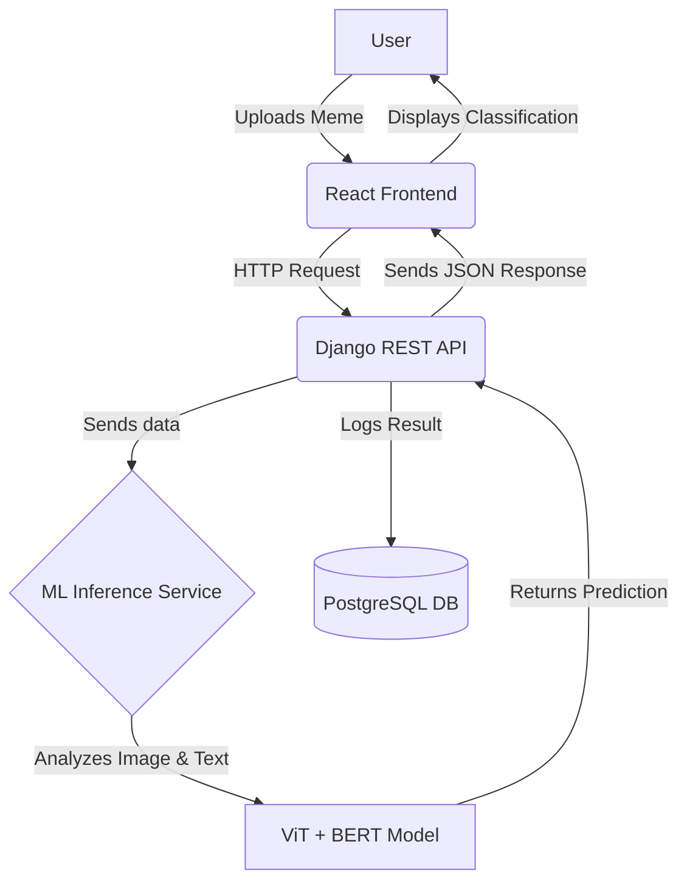

# Fine-grained Hate Meme Detection & Classification Platform

[](https://opensource.org/licenses/MIT)
[](...) A full-stack, containerized web application developed for a Master's thesis to detect and perform fine-grained classification of hateful content in memes using a state-of-the-art multimodal deep learning model.

**[Live Demo Link Here]** ---

##  Project Overview

The proliferation of hateful memes on social media presents a significant challenge for content moderation. These memes are multimodal, combining images and text to convey messages that are often missed by systems analyzing only one modality. This project introduces an end-to-end solution that leverages a deep learning model to understand both visual and linguistic cues, providing a more accurate and nuanced classification of hateful content.

### System Architecture
The application is designed with a microservices-inspired architecture, fully containerized using Docker for seamless development, testing, and deployment.



---

## Key Features

-   **High-Accuracy Multimodal Model:** Fuses features from a Vision Transformer (ViT) and BERT to capture complex interactions between image and text.
-   **Fine-Grained Classification:** Classifies memes into specific categories of hate (e.g., racism, sexism, religious discrimination) rather than a simple binary output.
-   **Interactive Web Interface:** A clean, responsive UI built with React allows users to easily upload a meme and receive instant classification results.
-   **Scalable REST API:** A robust backend built with Django and Django REST Framework to serve the model and manage data.
-   **Containerized & Reproducible:** The entire stack is orchestrated by Docker Compose, enabling a simple, one-command setup on any machine.

---

## 🛠 Technology Stack

| Category      | Technologies                                                                          |
| :------------ | :------------------------------------------------------------------------------------ |
| **ML / Python** | `PyTorch`, `Transformers (Hugging Face)`, `OpenCV`, `Scikit-learn`                      |
| **Backend** | `Django`, `Django REST Framework`, `PostgreSQL`                            |
| **Frontend** | `React`, `JavaScript (ES6+)`, `CSS3`                                           |
| **DevOps** | `Docker`, `Git`, `GitHub`                                             |

---

## ⚙ Local Setup and Installation

### Prerequisites
-   [Git](https://git-scm.com/)
-   [Docker](https://www.docker.com/products/docker-desktop/)

### Installation Steps

**1. Clone the Repository:**
```bash
git clone [https://github.com/](https://github.com/)[Your-Username]/hate-meme-detection-platform.git
cd hate-meme-detection-platform
```

**2. Configure Environment Variables:**
The backend requires specific environment variables. Copy the example file and fill in your details.
```bash
cp backend/.env.example backend/.env
```
Open `backend/.env` with a text editor and provide values for the `SECRET_KEY`, `POSTGRES_DB`, `POSTGRES_USER`, and `POSTGRES_PASSWORD`.

**3. Build and Run the Application:**
Use Docker Compose to build the images and launch all the services.
```bash
docker-compose up --build -d
```
*The `-d` flag runs the containers in detached mode.*

**4. Access the Application:**
-   **Frontend (React):** [http://localhost:3000](http://localhost:3000)
-   **Backend API (Django):** [http://localhost:8000/api/](http://localhost:8000/api/)

To stop the application, run:
```bash
docker-compose down
```

---

## API Endpoints

The primary API endpoint for classification is:

| Method | Endpoint             | Description                                  |
| :----- | :------------------- | :------------------------------------------- |
| `POST` | `/api/classify/`     | Uploads a meme image for classification.     |

**Request Body (`multipart/form-data`):**
-   `image`: The image file of the meme.

**Success Response (`200 OK`):**
```json
{
    "prediction": "Hateful",
    "confidence": 0.92,
    "fine_grained_class": "Racism"
}
```

---

## ML Model Deep Dive

-   **Architecture:** A fusion model combining the output embeddings from a pre-trained `ViT-B/16` (for image features) and `BERT-base-uncased` (for text features extracted via OCR). The concatenated features are passed through a Multi-Layer Perceptron (MLP) for final classification.
-   **Dataset:** The model was fine-tuned on the [Hateful Memes Challenge dataset by Facebook AI](https://ai.facebook.com/hateful_memes/) and augmented with `[mention any other data source you used]`.
-   **Performance:**
    -   **Accuracy:** `[e.g., 88.5%]`
    -   **F1-Score:** `[e.g., 0.89]`
    -   **AUC-ROC:** `[e.g., 0.91]`

---

## 📜 License

This project is distributed under the **MIT License**. See the `LICENSE` file for more information.

---

## 🙏 Acknowledgments

-   A heartfelt thank you to my thesis supervisor, **[Dr. Gyanendro Loitongbam]**, for their invaluable guidance.
-   This project utilizes powerful open-source libraries like **PyTorch**, **Transformers**, **Django**, and **React**.
-   Dataset provided by **[Facebook AI Research]**.

---

## ✉️ Contact

[Ghulam Haider] - [2024csm1008@iitrpr.ac.in] - [https://www.linkedin.com/in/ghulam-haider-b4185a193/]
